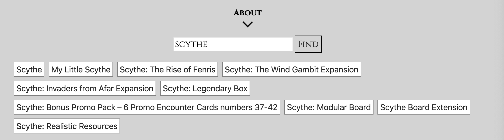
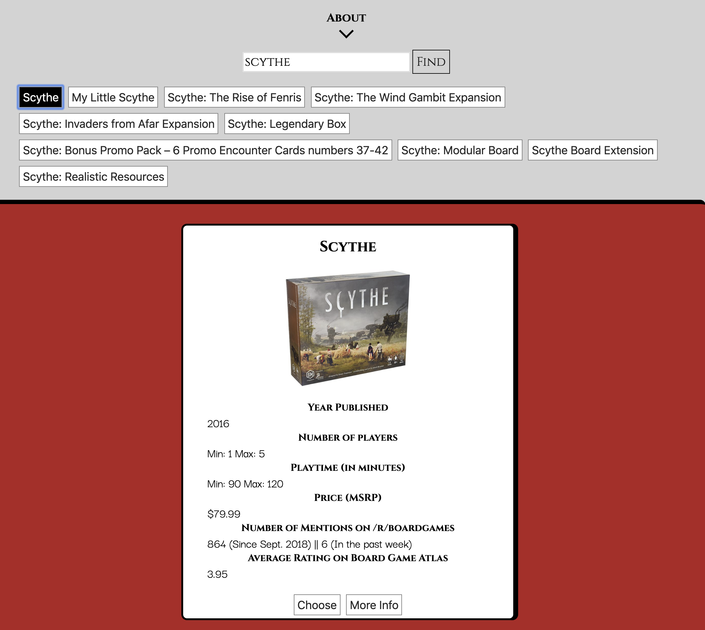
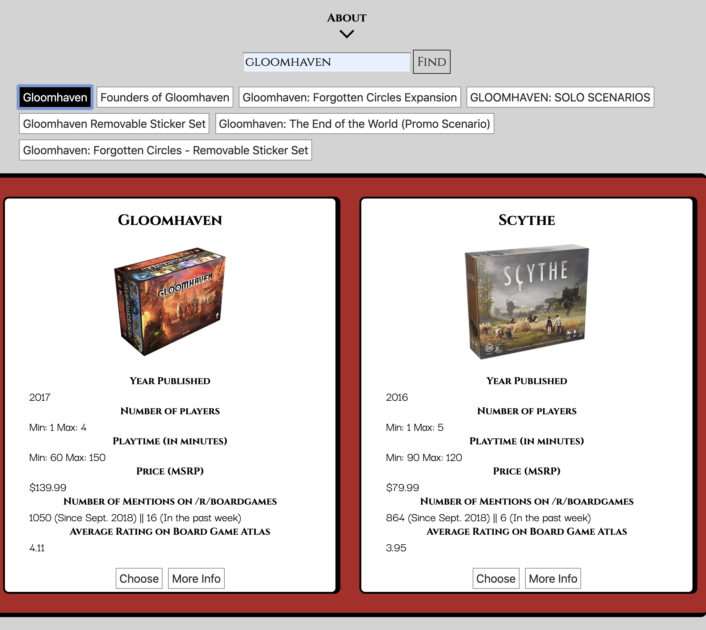
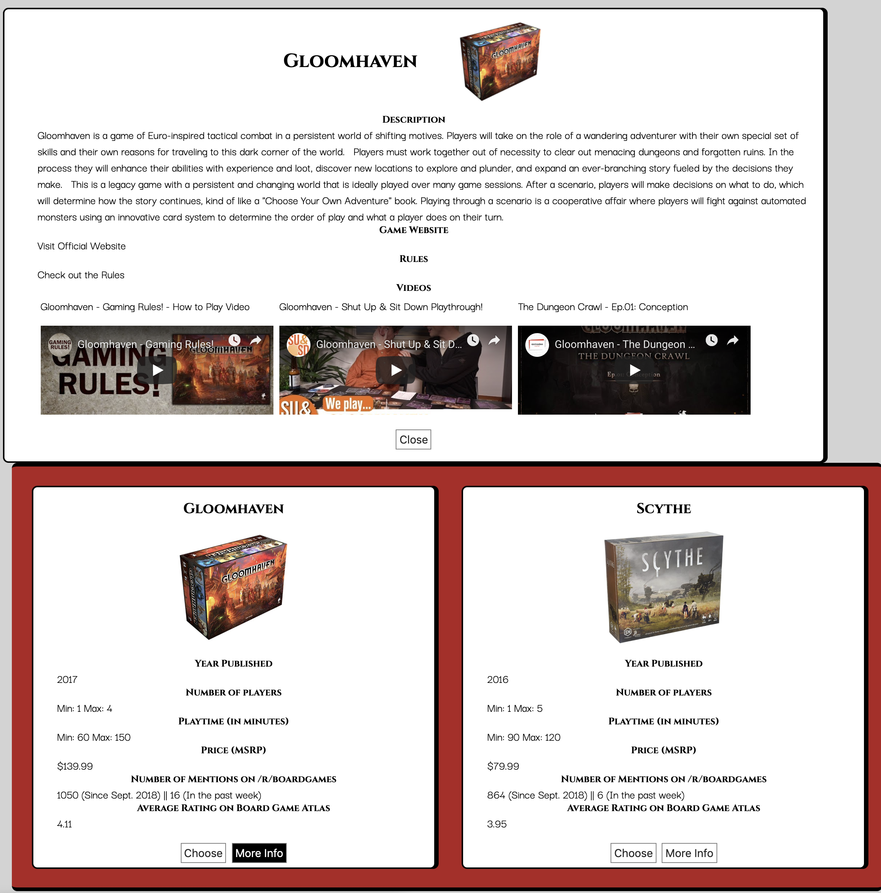
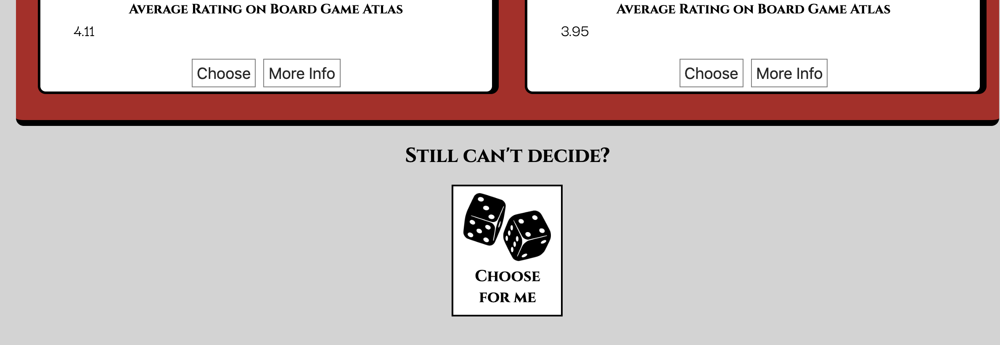
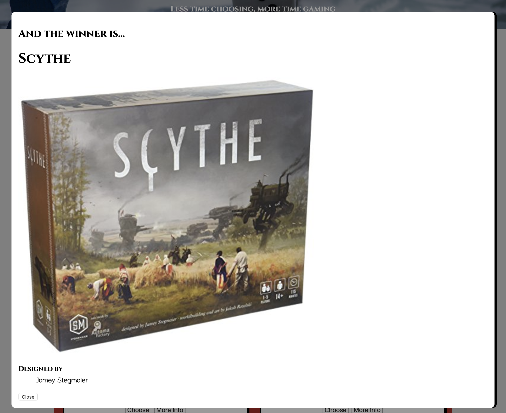

# Decide & Play
## Board game application

* Decide and play allows you to search for the board games you want to play, and helps you decide which one would be best based on key statistics. A random choose feature is provided for even faster decisions, or if your group still cant decide.
* Other features currently supported include: links to rules for each game (where possible), videos of YouTube videos about the game.

Live Site: https://jwaltz001.github.io/

GitHub Repo: https://github.com/jwaltz001/jwaltz001.github.io

## How It Works
1. Type in the name of a game you would like to search for:

2. Press enter or click the "Find" button to see the search results:

3. Click on one of the search results to see the game details:

4. Repeat for all game you are comparing:

5. Click the more info button for further information on each game:

6. If you still can't decide, then roll the dice by clicking the "choose for me" button:

7. Get a winner and go play!

## API Used for Info and Statistics
https://www.boardgameatlas.com/api/docs

##Images credit (used with permission)
Random dice image: https://pngimg.com/license
Header image: https://www.pexels.com/photo/blur-board-game-business-challenge-278918/
D20: Photo by Ian Gonzalez on Unsplash
